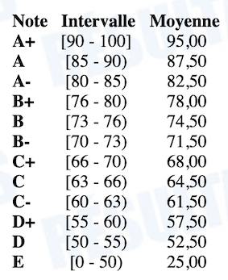

# MGK7460: Réalisation & Maintenance de Logiciels

## Informations Générales

  * Équipe Enseignante :
    * Professeur : Sébastien Mosser (UQAM, [Site web personnel](https://mosser.github.io), [Groupe de recherche ACE](https://ace-design.github.io))
    * Travaux Pratiques : Jean-Philippe Gélinas (SFL, Lévis), Jonatan Cloutier (SFL, Montréal)
  * Horaire du groupe `090`, session d'hiver 2020:
    * Cours : Jeudi, 15h00 - 18h00, _Tour Desjardins_
  * Communication :
    * Courriel (avec `[MGL7460-090]` en préfixe)

### Objectif du cours

### Évaluation & Planning de rendus

**Les dates de remise s'entendent sur le fuseau horaire de Montréal, à 23:50 le jour de la date de remise. Tout rendu hors délai recevra la note de zéro (0). Les règles concernant le plagiat seront appliquées sans aucune tolérance.**

| Date(s)        | Travail à rendre               | Objectif                                             | Poids |
| :---:          | :---                           | :---                                                 | :---: |
|   |   |   |   |

## Agenda des séances

En régime régulier, les cours ont lieu le jeudi, de 15h à 18h.

| #Semaine | Cours | Atelier |
| :---: | :---:   | :---    |
| 1  | Réaliser, Maintenir et Modéliser du logiciel ? |  --  |
| 2  | Gestion de versions, Démarche de tests  |  --  |
| 3  |  --  | _Git, Unit tests_  |
| 4  | Exigences, Scénarios d'acceptations  | --  |
| 5  | Déploiement continu, _Test-driven development_  | --  |
| 6  | --  |  _Gitlab CI, Cucumber_  |
| 7  | Analyse de code  | _Sonarqube_  |
| 8  | _Semaine de relâche_  | --  |
| 9  | Principes de développement (_CleanCode_, SOLID)  | --  |
| 10 | Métriques Logicielles & Visualisation pour la maintenance  |  --  |
| 11 | _Rencontres avec les équipes_  |  Suivi projet de session  |
| 12 | _Rencontres avec les équipes_  |  Suivi projet de session  |
| 13 | Cours d'ouverture  |   |

Matériel supplémentaire :

## Travaux

### Projets de session (à rendre)

## Barème

  - Le cours utilise la grille d'évaluation standard de l'UQAM définie dans RESULTATS.
  - La note de passage est de 50/100.
  - *Attention*: une note inférieure à 50/100 sur le projet individuel fait échouer le cours.

## Bibliographie

### Livres d'enseignement

  * _Introduction to Software Design with Java_. Springer, 2019.
    * Martin Robillard (_McGill University_).
    * [Accès PDF SpringerLink via UQAM](https://link.springer.com/book/10.1007%2F978-3-030-24094-3)
  * _UML@Classroom_, Springer Verlag, 2015.
    * Martina Seidl, Marion Scholz, Christian Huemer & Gerti Kappel (_Université de Technologie de Vienne_).
    * [Accès PDF SpringerLink via UQAM](https://link.springer.com/book/10.1007%2F978-3-319-12742-2)
    * [Site web ressource (diapos additionelles)](http://www.uml.ac.at/en/)

### Livres professionels

  * _Clean Code_. Prentice Hall.
    * Robert Martin.
    * Disponible en bibliothèque (BU Sciences, cote `QA 76.76 D47 M38 .2009`)
    * _(Existe en version française: "Coder proprement")_
  * _Pragmatic Unit Testing_. The pragmatic programmers.
    * Jeff Langr, with Andy Hunt and Dave Thomas.  
    * Disponible en bibliothèque (BU Sciences, cote `QA 76.73 J38 L36 .2015`)
  * _Refactoring: Improving the Design of Existing Code_, Addison Wesley, 2018 (2nd edition)
    * Martin Fowler.  
    * Disponible en bibliothèque (BU Sciences, cote `QA 76.76 R42 F69 .1999`)
  * _Code as a Crime Scene_. The pragmatic programmers.
    * Adam Tornhill.  

## Règlement 18 sur les Infractions de nature académique

Tout acte de plagiat, fraude, copiage, tricherie ou falsification de document commis par un.e étudiant.e, de même que toute participation à ces actes ou tentative de  les commettre, à l’occasion d’un examen ou d’un travail faisant l’objet d’une évaluation ou dans toute autre circonstance, constituent une infraction au sens de ce règlement.

La liste non limitative des infractions est définie comme suit :

  * la substitution de personnes ;
  * l’utilisation totale ou partielle du texte d’autrui en le faisant passer pour sien ou sans indication de référence ;  
  * la transmission d’un travail aux fins d’évaluation alors qu’il constitue essentiellement un travail qui a déjà été transmis aux fins d’évaluation académique à l’Université ou dans une autre institution d’enseignement, sauf avec l’accord préalable de l’enseignante, l’enseignant ;
  * l’obtention par vol, manœuvre ou corruption de questions ou de réponses d’examen ou de tout autre document ou matériel non autorisés, ou encore d’une évaluation non méritée ;
  * la possession ou l’utilisation, avant ou pendant un examen, de tout document non autorisé ;
  * l’utilisation pendant un examen de la copie d’examen d’une autre personne ;
  * l’obtention de toute aide non autorisée, qu’elle soit collective ou individuelle ;
  * la falsification d’un document, notamment d’un document transmis par l’Université ou d’un document de l’Université transmis ou non à une tierce personne, quelles que soient les circonstances ;
  * la falsification de données de recherche dans un travail, notamment une thèse,  un mémoire, un mémoire-création, un rapport de stage ou un rapport de recherche.

Les sanctions reliées à ces infractions sont précisées à l’[article 3 du Règlement no 18](https://instances.uqam.ca/wp-content/uploads/sites/47/2017/12/REGLEMENT_NO_18.pdf) sur les infractions de nature académique.

Vous pouvez consulter sur le site [r18.uqam.ca](http://r18.uqam.ca) des capsules vidéos qui vous en apprendront davantage sur l’intégrité académique et le R18, tout en vous  orientant vers les ressources mises à votre disposition par l’UQAM pour vous aider à éliminer le plagiat de vos travaux.
